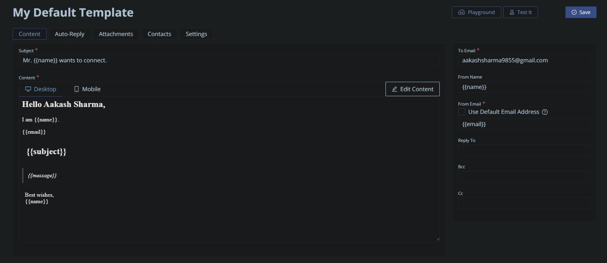

# Personal Portfolio

This personal portfolio is a web application built using Next.js, React.js, Tailwind CSS, Emailjs, and Framer Motion. It serves as a showcase of my work, skills, and experience.

## Installation

To run this project locally, follow these steps:

1. Clone the repository from GitHub:
   ```bash
   git clone https://github.com/aakash-sharma-github/Portfolio_Website.git
   ```
2. Navigate to the project directory:
   ```bash
   cd Portfolio_Website
   ```
3. Install the required dependencies:
   ```bash
   npm install
   ```

## Usage

To start the development server and view the portfolio:

```bash
npm run dev
```

Open [http://localhost:3000](http://localhost:3000) to view it in the browser.

## Features

- **Next.js**: Utilized for server-side rendering and optimized for production.
- **React.js**: Used to build the user interface and manage the application's state.
- **Tailwind CSS**: Employed for styling the components and creating a responsive layout.
- **Emailjs**: Integrated for the contact form functionality and sending emails from the portfolio.
- **Framer Motion**: Implemented for adding smooth animations to enhance the user experience.

## Configuration

Ensure to configure the necessary environment variables for Emailjs according to the provided API credentials and setup. This is my template of Emailjs.com



## Contributing

This portfolio is a personal project, but contributions, issues, and feature requests are welcome. Feel free to submit a pull request or open an issue on GitHub.

## License

This project is open source.

## Acknowledgements

- Next.js
- React.js
- Tailwind CSS
- Emailjs
- Framer Motion
- And all other dependencies used in the project.

## Contact

Thank you for checking out my portfolio! If you have any questions or suggestions, please don't hesitate to contact me, Aakash Sharma, at [aakashsharma9855@gmail.com](mailto:aakashsharma9855@gmail.com).
